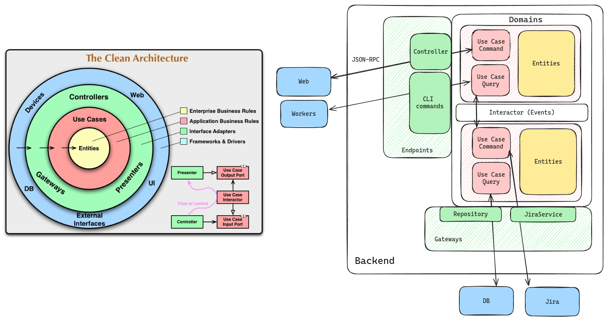

Архитектура предполагает набор соглашений по самым общим характеристикам  
кода: определение областей ответственности классов и определение характера связей между ними.  
Архитектура бэкенда в конечном счете сводится к набору запросов (query) и команд (command),  
а также к способам их вызова.

## Общая схема

В качестве основы выбрана Clean Architecture, как достаточно простая и универсальная
концепция. Также мы ориентируемся на подходы DDD и CQRS, однако не в полной мере,
а только в моментах, когда это приносит реальную пользу

### Entity

Entity (сущность) - класс, инкапсулирующий самую базовую бизнес-логику. Задача entity
в том, чтобы обеспечить непротиворечивое внутреннее состояние данных (инвариант).
Entity ни от чего не зависит, но может иметь поведение в контексте
(реализуя интерфейс или используя аттрибуты)

> Проверки внутри сущности не заменяют constraints, определяемые в БД, а скорее дополняют их, особенно
> если данные в БД были спроектированны недостаточно хорошо. Также нужно учитывать,
> что не все проверки могут быть эффективно реализованы на уровне сущности (например, проверка на уникальность)

Хотя **строка таблицы** и **сущность** имеют много общего, они также имеют важные различия

| Table record                                                           | Entity                                                          |
|------------------------------------------------------------------------|-----------------------------------------------------------------|
| Содержит список всех полей, которые должны быть персистентно сохранены | Может не содержать все поля из БД, может иметь вычисляемые поля |
| Имеет плоскую структуру                                                | Поля тоже могут быть сущностями или коллекциями сущностей       |
| Предопределенные операции: INSERT SELECT UPDATE DELETE                 | Операции в терминах бизнеса                                     |

### Use Case

Логика некоторого ожидаемого действия. Обязателен, иначе вызов не имеет смысла.  
В идеале, должен быть понятен не-программисту и читаться как инструкция на английском.  

### Gateway

Gateways это набор интерфейсов для внедрения не-бизнесовой логики в бизнесовую.  
По мере возможности, делятся на read и write интерфейсы.

### Repository

Специальный сервис для работы с БД. Служит для сохранения / загрузки состояния сущностей.

### Endpoints (Controller, Command)

Контроллер или CLI команда - то, что связывает UseCase со способом его вызова.  
