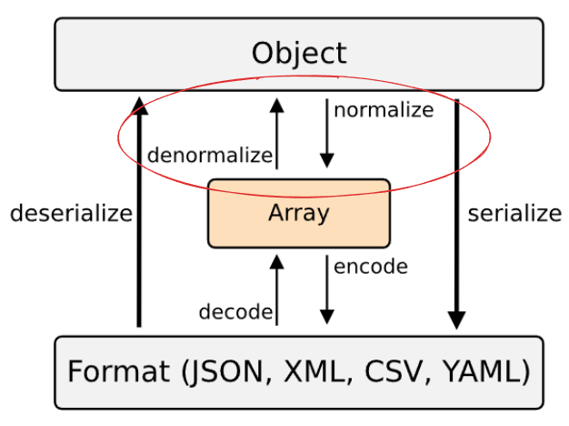

> Этот раздел документации частично устарел и требует доработки

- Как внедрять общий функционал в контроллеры?

Каждый контроллер имеет свои собственные зависимости

- Что должно выполнятся как можно раньше?

Валидация, проверка доступа, кэш. Общая часть должна выполнятся автоматически,
более тонкая настройка - через аттрибуты.
В исключительных случаях явно внедряется зависимость.

- Как считать total (общее кол-во элементов коллекции) ?

Отдельным запросом. Есть стандартный механизм, но можно и задать явно.

- можно ли в 1 контроллере запрашивать юзкейсы разных доменов?

Не очень разумно смешивать несколько юзкейсов в 1 контроллере.
Если нужно соединить поведение 2 юзкейсов, значит
это или 3 юзкейс, или замена 2 юзкейсов на 1.

https://www.google.com/search?q=когда+переиспользование+кода+это+плохо

- насколько репозитории связаны с юзкейсами, могут ли переиспользоваться

Репозитории могут переиспользоваться, но только в своих доменах, так как завязаны
на entity своего домена

- По какому принципу разделяются домены?

Про степени связности данных. Если у нас есть нескольно таблиц, которые
много ссылаются друг на друга, но мало на остальные таблицы - это
скорее всего отдельный домен. В целом, вопрос сложный и всегда требует всестороннего анализа

- Entity | DTO | array - что использовать в репозиториях?

Удобнее всего использовать только Entity. Поэтому entity должны иметь возможность
"загружаться" из DTO и из массива

- Так всё-таки как Entity связаны с таблицами?

Они связаны через аттрибуты `Database\ORM\Attribute\{Column, Entity}`
Заготовку под Entity можно генерировать из БД, дальше можно её дописывать,
добавляя некоторую бизнес-логику. Репозиторий использует Entity, чтобы сформировать sql запрос

- Будет ли использоваться ORM?

На данный момент мы пришли к соглашению использовать упрощенный ORM

* при нормализации данных используем свою реализацию dirty tracking
* при денормализации - маппим в объекты автоматически, учитывая вложенность, коллекции, перечисления

- Как подключить Repository в UseCase (generics)?

В UseCase можно нужно указать зависимость как Repository<Entity>,
затем выполнить команду `php bin/refreshGenerics.php` для регистрации репозитория.
