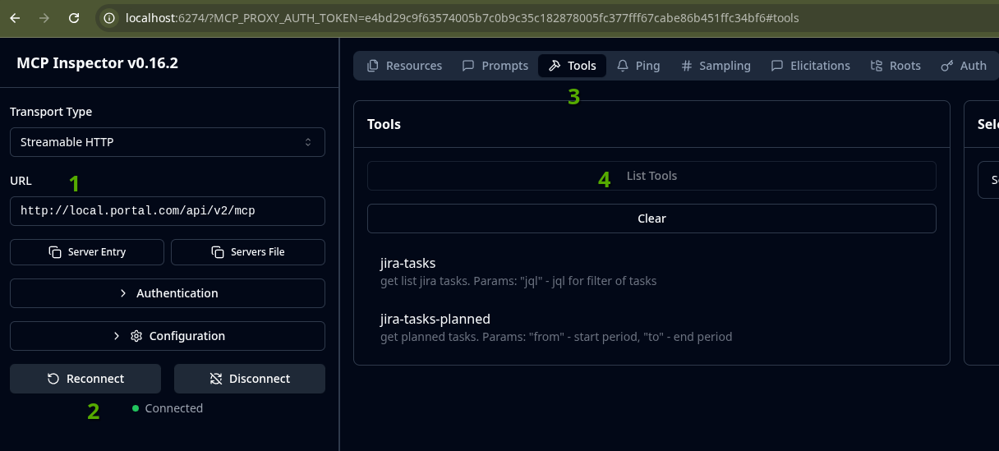

Но портале настроен MCP сервер, который позволяет внедрять
наши эндпоинты в SW Chat или в локально работающие агенты.  
Подробнее про MCP: https://modelcontextprotocol.io/docs/getting-started/intro

> **Важно!** В данный момент авторизация не настроена, не добавляйте
> эндпоинты, которые могут содержать конфиденциальную информацию

# Регистрация эндпоинта

Для регистрации эндпоинта в MCP, нужно использовать аттрибуты:
- #[McpTool] - для регистрации tools
- #[McpResource] - для регистрации статичных ресурсов
- #[McpResourceTemplate] - для регистрации шаблонов ресурсов
- #[McpPrompt] - для регистрации промптов

Примеры:  
https://github.com/php-mcp/server?tab=readme-ov-file#1-%EF%B8%8F-attribute-based-discovery-recommended

# Отладка

Используйте команду `composer mcp-client`, чтобы запустить интерфейс для
тестирования MCP эндпоинтов.

Для получения списка доступных tools:

1. Укажите базовый url вида http://{DOMAIN}/api/v2/mcp
2. Нажмите "Connect"
3. Выберите "Tools"
4. Нажмите "List Tools"
