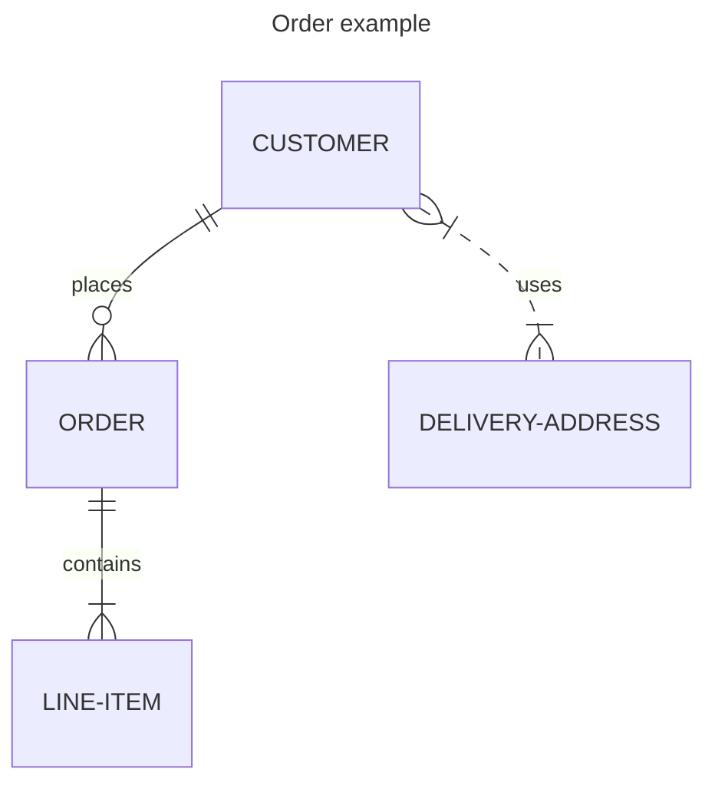

# Как спроектировать новый сервис

1. Прочитай задачу {{JIRA_TASK_CODE}} и изучи все вложенные требования.
2. Проверь список существующих сервисов. Если новая задача в существующем домене - запомни домен, прочитай какие уже есть Entity.
3. Сформируй список эндпоинтов. Пример:

| Endpoint                                 | Description                              | UseCase name                 |
|------------------------------------------|------------------------------------------|------------------------------|
| finance.pointsLoan.getPartnerStats       | Информация о партнере и его показателях  | GetPartnerStatsUseCase       |
| finance.pointsLoan.getCurrentPeriod      | Получить текущий период для выдачи займа | GetCurrentPeriodUseCase      |
| finance.pointsLoan.getPartnerLoanHistory | История займов партнера                  | GetPartnerLoanHistoryUseCase |
| finance.pointsLoan.editLoan              | Редактировать заём                       | EditLoanUseCase              |
| finance.pointsLoan.deleteLoan            | Удалить заём                             | DeleteLoanUseCase            |

4. На основании SQL запросов из ТЗ сформируй ERM диаграмму в mermaid формате. Пример:

